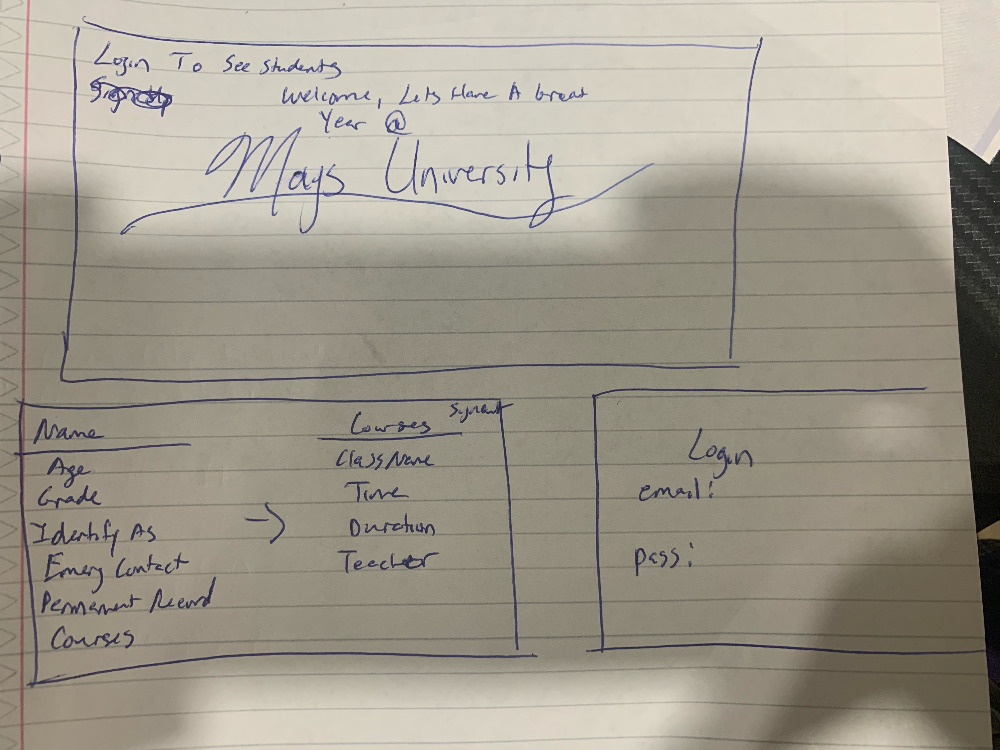
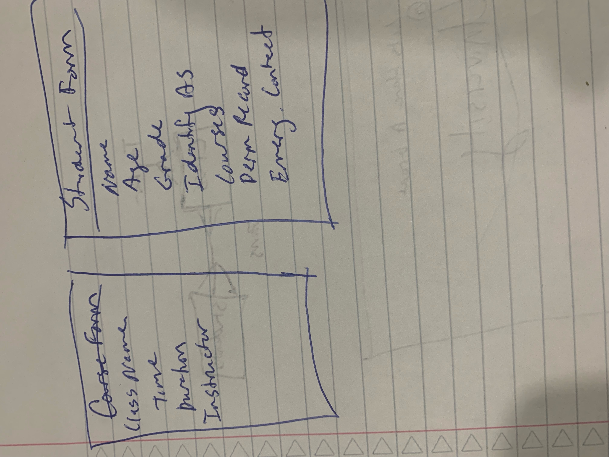
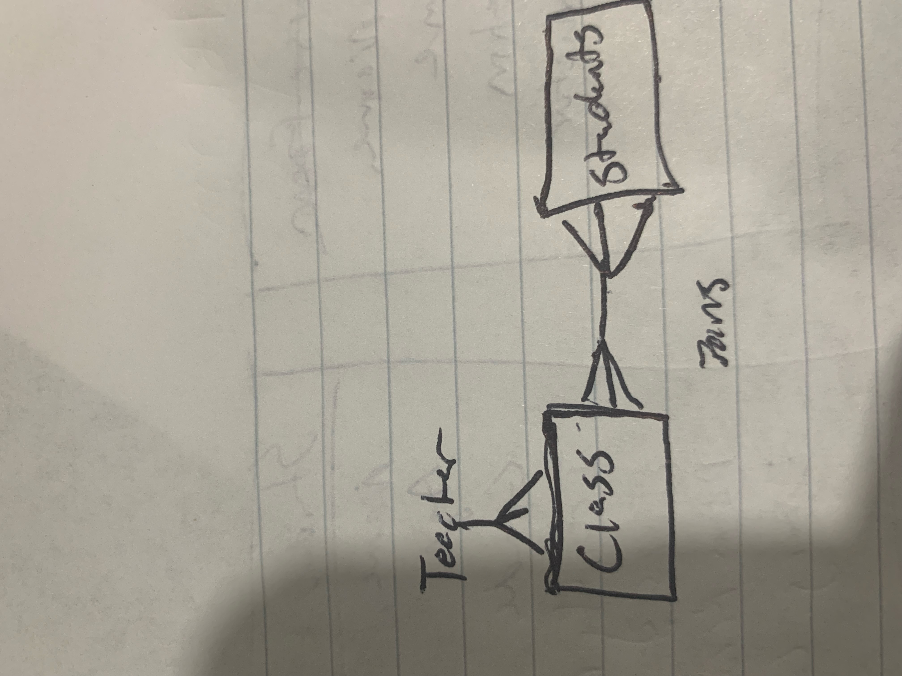

###Installation Instructions
You Need To Run: python manage.py runserver

### User Stories
-As an unauthenticated user, I want to be able to sign up..
-As an unauthenticated user, I want to be able to log in.
-As an authenticated user, I want to be able to change my password.
-As an authenticated user, I want to be able to log out.
-As an authenticated user, I want to be able to see all students.
-As an authenticated user, I want to be able to see a single student.
-As an authenticated user, I want to be able to create/enter a student into the system.
-As an authenticated user, I want to be able to edit/update a student's details.
-As an authenticated user, I want to be able to add class courses to a student.
-As an authenticated user, I want to be able to delete/remove a student.
-As an authenticated user, I want to be able to see all courses associated with a student.
-As an authenticated user, I want to be able to add a course to a student.
-As an authenticated user, I want to be able to update the course on a student.
-As an authenticated user, I want to be able to delete a course off a student's schedule.

### Models
User

Username: String
Password: String (hashed)
Token: String
Students: Array

Student
    Name: String
    Age: Number
    Grade: enum
    Identify As: String
    Courses: Array
    Emergency Contact Telephone #: String
    Permanent Record: String

Courses (subdoc)
    Name: String
    Time: String
    Duration: String
    Instructor: String

### Authentication

| Verb   | URI Pattern            | Controller#Action |
|--------|------------------------|-------------------|
| POST   | `/sign-up`             | `users#signup`    |
| POST   | `/sign-in`             | `users#signin`    |
| PATCH  | `/change-password/` | `users#changepw`  |
| DELETE | `/sign-out/`        | `users#signout`   |

###URLs
|---------|-----------------------|-----------|----------------------|
| INDEX   | students index         | GET       | `/students`          |
| SHOW    | student show page     | GET       | `/students/:id`      |
| NEW     | new student form      | POST      | `/students/new`      |
| CREATE  | create new student    | POST      | `/students`          |
| EDIT    | edit existing student | GET       | `/students/:id/edit` |
| UPDATE  | update student       | PATCH     | `/students/:id`      |
| DESTROY | remove student        | DELETE    | `/students/:id`      |
### Medicine Routes
#### Express
| REST    | Description           | HTTP Verb | Express Route        |
|---------|-----------------------|-----------|----------------------|
| NEW     | create new course   | POST      | `/courses/`        |
| UPDATE  | update course       | PATCH     | `/courses/:id`     |
| DESTROY | remove course      | DELETE    | `/courses/:id`     |

### Wireframes

###ERD
